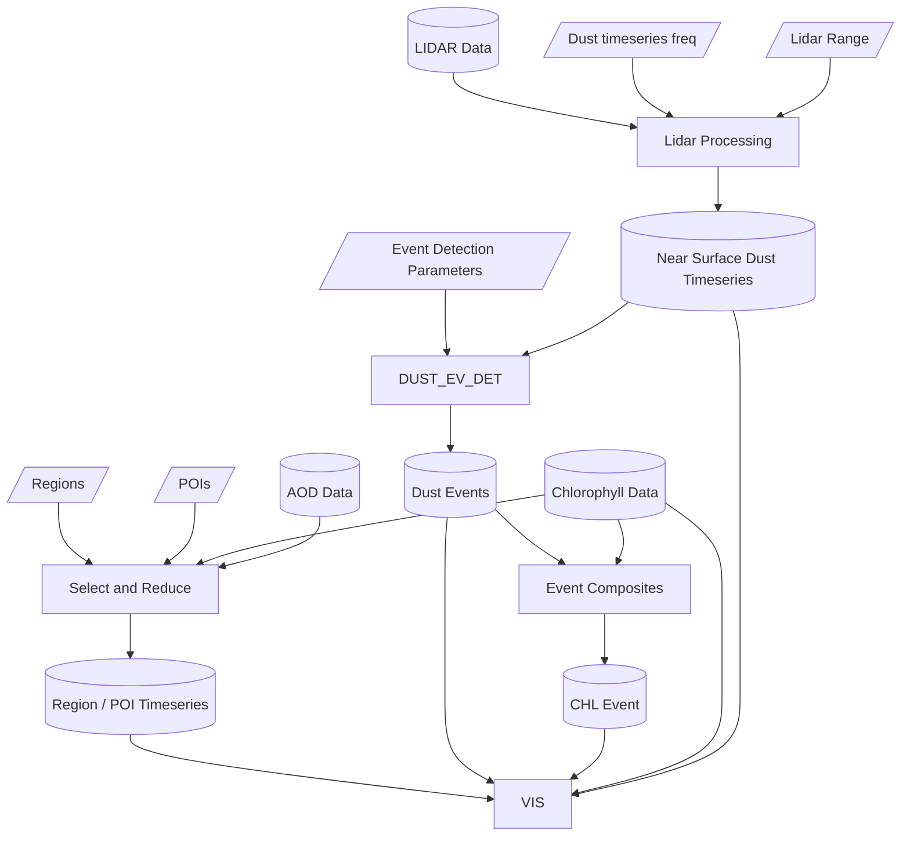

# Cabo-Verde-Dust

```mermaid
flowchart TD
    %% datasets
    LIDAR[(LIDAR Data)]
    AOD[(AOD Data)]
    CHL[(Chlorophyll Data)]
    NSDST[(Near Surface Dust Timeseries)]
    REG_POI_TS[(Region / POI Timeseries)]
    DST_Events[(Dust Events)]
    CHL_Comp[(CHL Event)]

    %% user choices
    RGS[/Regions/]
    POI[/POIs/]
    LIDAR_RNG[/Lidar Range/]
    DUST_FREQ[/Dust timeseries freq/]
    EVPRM[/Event Detection Parameters/]

    %% Process LIDAR data
    LIDAR --> LDRPRC[Lidar Processing]
    DUST_FREQ --> LDRPRC
    LIDAR_RNG --> LDRPRC
    LDRPRC --> NSDST

    %% Visualize
    REG_POI_TS --> VIS
    DST_Events --> VIS
    CHL_Comp --> VIS
    CHL --> VIS
    NSDST --> VIS
    
    %% Select timesereis
    RGS --> SLCT_RED
    POI --> SLCT_RED
    CHL --> SLCT_RED
    AOD --> SLCT_RED[Select and Reduce]
    SLCT_RED --> REG_POI_TS

    %% Event detection
    EVPRM --> DUST_EV_DET
    NSDST --> DUST_EV_DET
    DUST_EV_DET --> DST_Events

    %% Event Composite
    DST_Events --> EV_COMP[Event Composites]
    CHL --> EV_COMP
    EV_COMP --> CHL_Comp
```